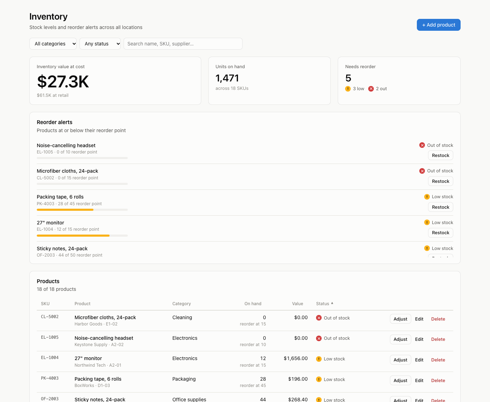
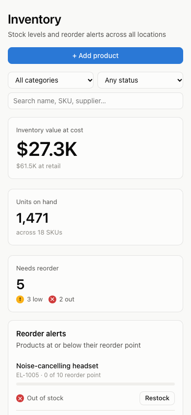
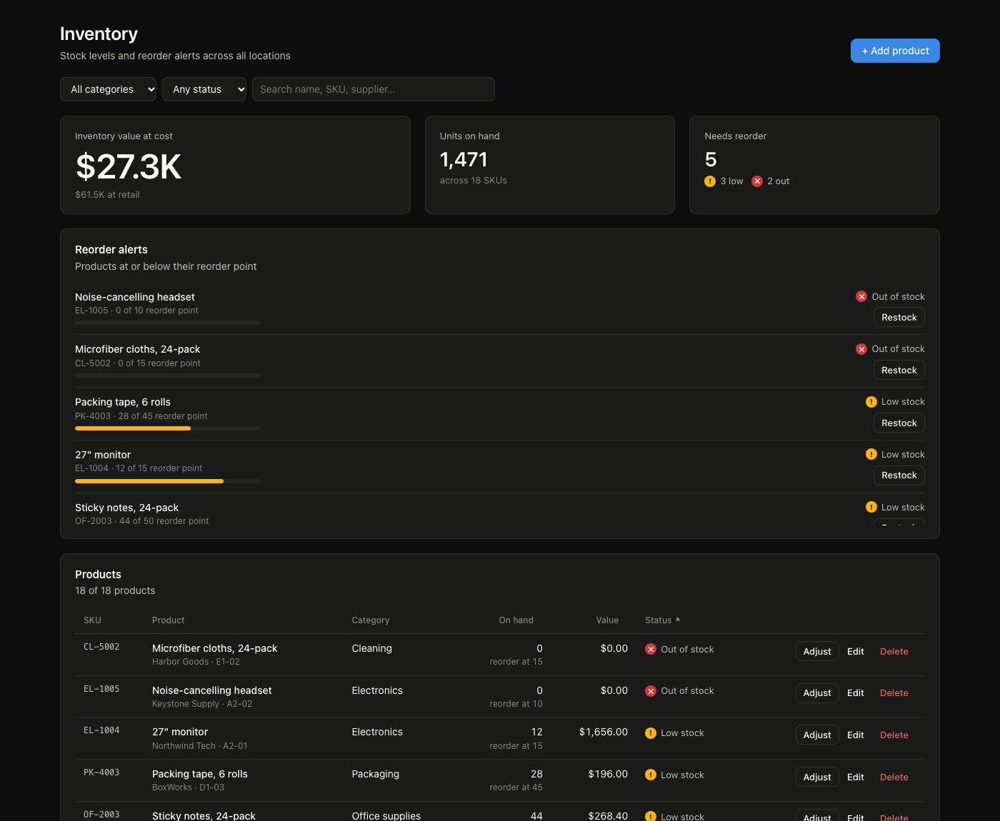

# Inventory Management Dashboard

A responsive inventory dashboard built with React and TypeScript. Track stock levels, see what needs reordering, and add, edit, restock or delete products. All data is saved through a REST API.



<p align="center">
  
</p>

<details>
<summary>Dark mode</summary>



</details>

## Features

- **Product table**: sortable by SKU, name, category, quantity, value or stock status
- **Search**: by product name, SKU, supplier or warehouse location
- **Filters**: by category and stock status, combined with search
- **Add, edit and delete products**, with form validation (required fields, unique SKUs, no negative numbers)
- **Stock alerts**: summary tiles for inventory value and units on hand, plus a reorder list of products at or below their reorder point, most urgent first
- **Stock adjustments**: receive or ship stock from the alert list or the table
- **REST API**: products are loaded and saved through [json-server](https://github.com/typicode/json-server)
- **Loading and error states**: a loading indicator, a clear message with a retry button when the API is unreachable, and inline errors when a save fails
- **Responsive design**: the table becomes stacked cards on tablets and phones, with its own sort control
- **Light and dark mode**, following your system setting
- **Accessible status indicators**: stock status always uses an icon and a label, never colour alone

## Tech stack

- [React 19](https://react.dev/) + [TypeScript](https://www.typescriptlang.org/)
- [Vite](https://vite.dev/) for development and builds
- [json-server](https://github.com/typicode/json-server) as a mock REST API
- Plain CSS with custom properties (no UI library)

## Getting started

You need [Node.js](https://nodejs.org/) 20 or newer.

```bash
git clone https://github.com/chukuwyemokumbor/inventory-management-dashboard.git
cd inventory-management-dashboard
npm install
npm run dev
```

`npm run dev` starts both the API (http://localhost:3001) and the web app (http://localhost:5173). Open http://localhost:5173 in your browser.

### Scripts

| Command | What it does |
| --- | --- |
| `npm run dev` | Starts the API and the web app together |
| `npm run web` | Starts only the web app |
| `npm run api` | Starts only the API |
| `npm run api:reset` | Restores the sample products |
| `npm run build` | Type-checks and builds for production into `dist/` |
| `npm run lint` | Runs ESLint |

### Data

On first start, the API copies `server/db.seed.json` (18 sample products) to `server/db.json` and saves your changes there. `db.json` is ignored by git, so your edits never show up as code changes. Run `npm run api:reset` to start over with the sample data.

To point the app at a different API, copy `.env.example` to `.env` and change `VITE_API_URL`.

## API

| Method | Endpoint | Description |
| --- | --- | --- |
| `GET` | `/products` | List all products |
| `POST` | `/products` | Create a product |
| `PATCH` | `/products/:id` | Update fields on a product (e.g. quantity) |
| `DELETE` | `/products/:id` | Delete a product |

A product looks like this:

```json
{
  "id": "seed-1",
  "sku": "EL-1001",
  "name": "Wireless mouse",
  "category": "Electronics",
  "quantity": 142,
  "reorderPoint": 40,
  "unitCost": 8.5,
  "price": 24.99,
  "supplier": "Northwind Tech",
  "location": "A1-03",
  "updatedAt": "2024-06-16T09:00:00.000Z"
}
```

A product is **low stock** when its quantity is at or below its reorder point, and **out of stock** at zero.

## Project structure

```
server/
├── db.seed.json        Sample data the API starts from
└── ensure-db.mjs       Creates or resets server/db.json
src/
├── components/         UI pieces: table, dialogs, tiles, alerts, status badge
├── data/
│   ├── api.ts          REST client and error messages
│   ├── format.ts       Money, number and stock-status helpers
│   └── useInventory.ts React hook: loads products, add/edit/adjust/delete
├── pages/
│   └── Dashboard.tsx   The dashboard page, filters and dialogs
├── types/
│   └── inventory.ts    Product and stock-status types
├── App.tsx
├── App.css             Component and layout styles
└── index.css           Colour tokens (light and dark) and base styles
```
